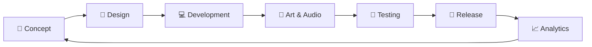

# 🎮 Nông Đức Toàn - Game Developer Portfolio

  
  
  

## 👋 Giới thiệu

Xin chào! Tôi là **Nông Đức Toàn**, một Game Developer đam mê tạo ra những trải nghiệm game thú vị và hấp dẫn. Với kinh nghiệm phát triển game trên Unity và các công nghệ hiện đại, tôi luôn tìm kiếm những thách thức mới để nâng cao kỹ năng và tạo ra những sản phẩm chất lượng.

## 🎯 Dự án nổi bật

### 🏆 Immortal Legend
- **Thể loại**: Action RPG
- **Công nghệ**: Unity 3D, C#, ShaderLab
- **Tính năng chính**:
  - Combat system phức tạp với combo attacks
  - AI enemies thông minh với behavior trees
  - Skill system với upgrade paths
  - Procedural level generation
  - Multiplayer co-op mode

## 💼 Kinh nghiệm

### Game Studio - Unity Developer
- Phát triển mobile games cho iOS và Android
- Thiết kế và implement game mechanics
- Tối ưu hóa performance cho mobile devices
- Làm việc với team artists và designers

## 🛠️ Kỹ năng kỹ thuật

### Game Development
- **Unity 3D** - Engine chính cho game development
- **C#** - Ngôn ngữ lập trình chính
- **ShaderLab** - Tạo custom shaders và visual effects
- **Unity Animation System** - Character animation và cutscenes

### Tools & Technologies
- **Git** - Version control và collaboration
- **Photoshop** - Asset creation và UI design
- **Blender** - 3D modeling và animation
- **Visual Studio** - IDE development

### Platforms
- **Mobile Games** (iOS, Android)
- **PC Games** (Windows, Mac)
- **Web Games** (WebGL)

## 📱 Liên hệ

- 📧 **Email**: [Toan.tq.hy.24@gmail.com](mailto:Toan.tq.hy.24@gmail.com)
- 💼 **LinkedIn**: [Nông Đức Toàn](https://linkedin.com/in/your-profile)
- 🐙 **GitHub**: [@yourusername](https://github.com/yourusername)
- 🎮 **Itch.io**: [Your Game Portfolio](https://yourusername.itch.io)

## 📊 GitHub Stats

  
  

## 🎮 Game Development Journey

---

  
💡 <em>"Tạo ra những trải nghiệm game đáng nhớ là niềm đam mê của tôi"</em>

  
⭐ Nếu bạn thích portfolio này, hãy star repo nhé!

